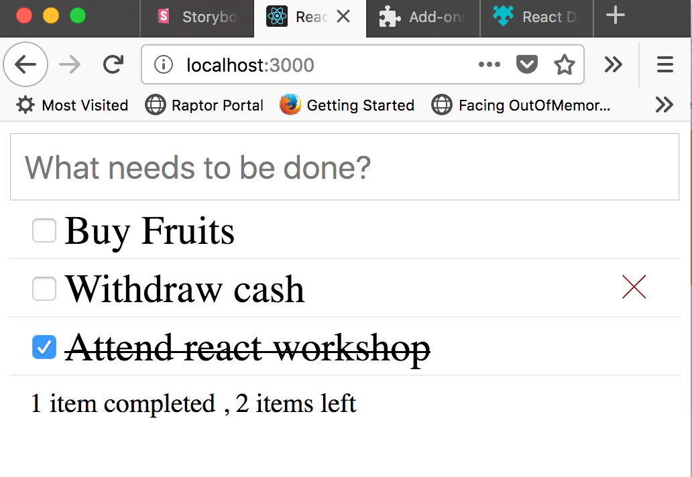

# TODO MVC Application using React & Redux

Inspired by [TodoMVC](http://todomvc.com/)

## Learning agenda
1. Setup a simple app
2. Hello World
3. Brush up ES6
4. Creating React Components
5. Adding styles
6. Handling UI events (interaction)
7. Lifting state up
8. Redux - connected components

## Operations
1. Add a new TODO item
2. Mark a TODO as completed
3. Delete a TODO item
4. Display status regarding the TODOs

## Test it out

Run the following commands to get the application running in your local:
1. yarn build
2. yarn start
3. http://localhost:3000/

## Sample Screenshot

